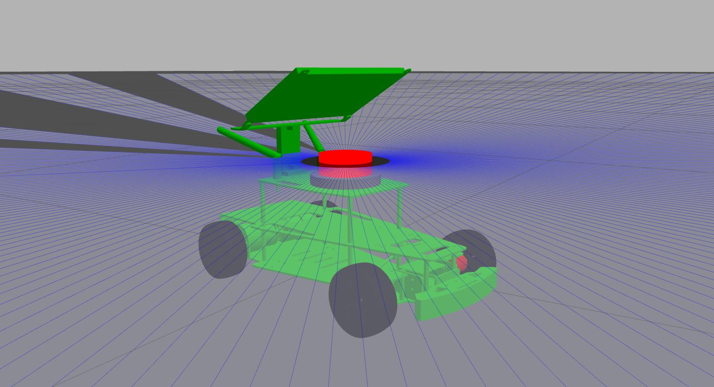
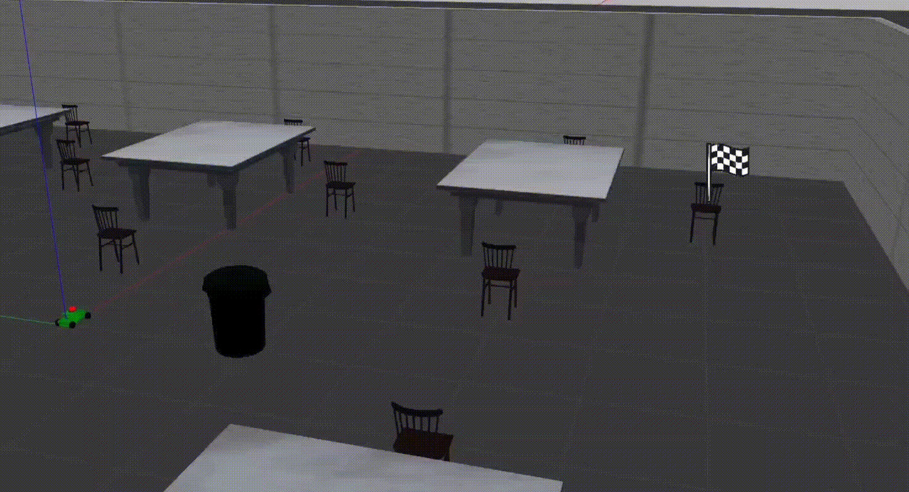
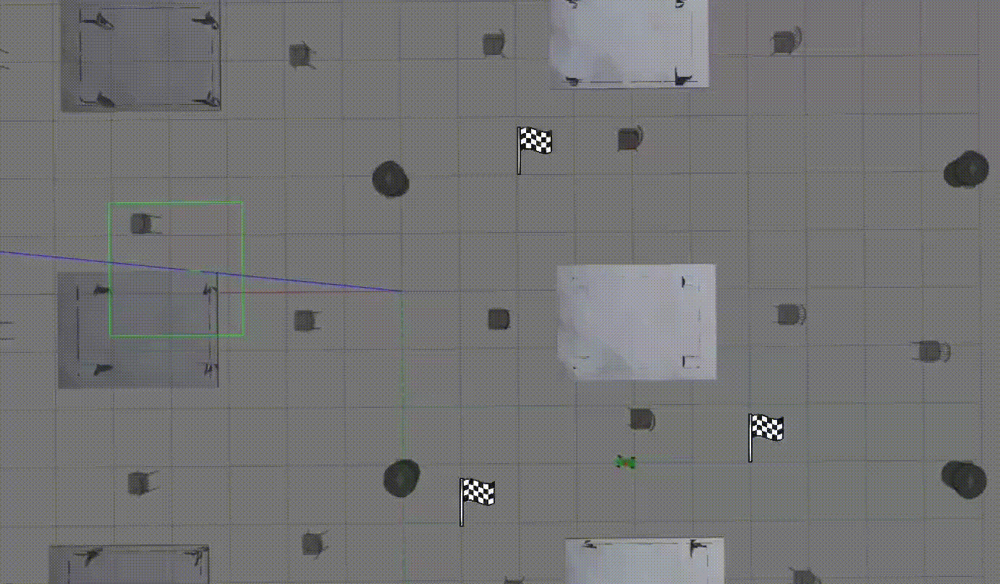

# ODAP
**Obstacle Detection and Avoidance Platform (ODAP)**

En el presente proyecto se configura una simulación para implementar RL usando DQN para un robot R2 de la marca Yahboom con configuración Ackermann.
Se muestran los archivos URDF del robot modificados a partir de los dados por Yahboom, el código de implementación del algoritmo DQN  y también los *world* de Gazebo utilizados para el entrenamiento y evaluación del modelo.
Por otra parte para el movimiento del robot se utiliza un nodo controlador para vehículos con configuración Ackermann obtenido del repositorio de "aizzat" y que puede encontrarse en el siguiente link: 
https://github.com/aizzat/ackermann_vehicle.

El espacio de observaciones del robot está compuesto de las tres últimas mediciones láser y las tres últimas medidas del ángulo hacia el objetivo (inspirado de 
[1](https://github.com/RoblabWh/RobLearn)), el espacio de acciones por su parte se compone de 7:

| **Velocidad (m/s)** | 1 | 2 | 3 | 4 | 5 | 6 | 7 |
| :------ | :--: | :--: | :--: | :--: | :--: | :--: | :--: |
| Lineal  | 0.8 | 0.8 | 0.8 | 1.0 | 0.5 | 0.5 | 0.5 |
| Angular | 0.0 | 0.6 | -0.6 | 0.0 | 0.0 | 0.4 | -0.4 |

El robot se entrenó usando ROS Noetic.

**Modelo R2 y LiDAR en Gazebo**

Algunas de las trayectorias generadas posterior al entrenamiento se observan aquí:

**Trayectoria 1**

**Trayectoria 2**

**Trayectoria 3**

